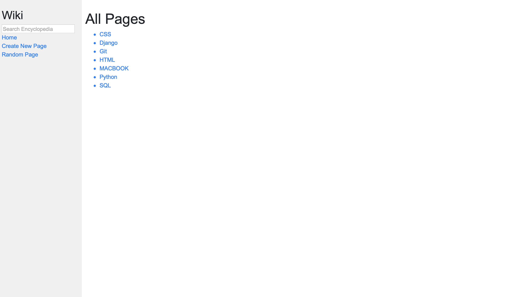
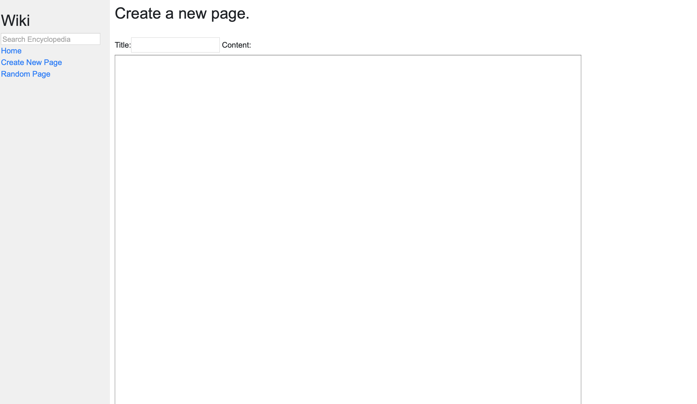
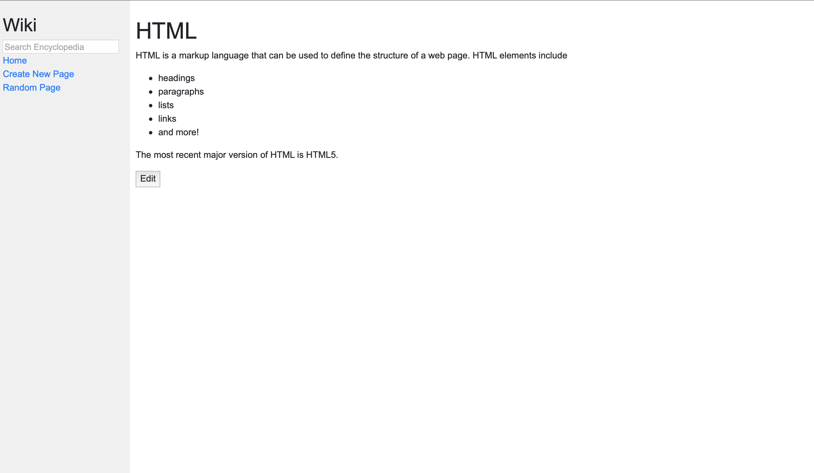

# Wiki

Wiki is a smaller version of the wikipedia, it is made using Django framework. It uses local storage for storing all the created pages.

These are the main operations which the wiki web application will allow you to do:

* Create new pages filled with information in the form of a .md (markdown) file.
* Edit those created files.
* You can view and access all the pages from the mainpage of the application.
* You can search for the pages as well.

Here are some of the photos of the interface,

&nbsp;

&nbsp;

